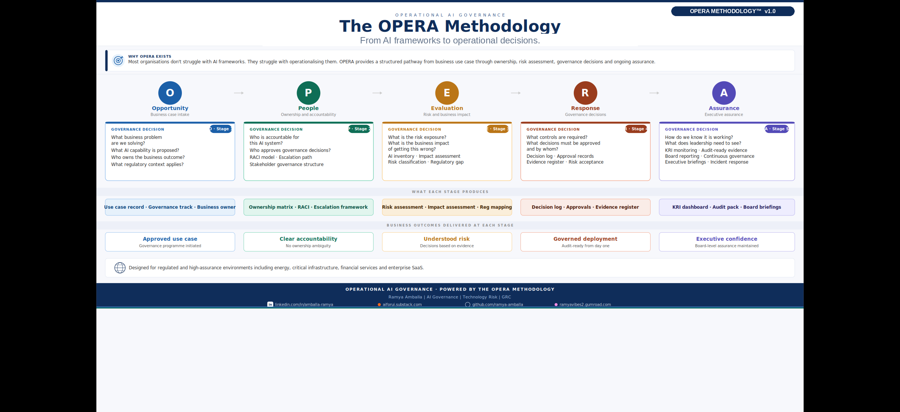

# OPERA Methodology

Turning AI governance requirements into operational decisions.

---

## Why OPERA Exists

Most organisations do not struggle because they lack AI governance frameworks.

They struggle with operationalising them.

OPERA provides a structured path from business use case through ownership, risk evaluation, governance decisions and ongoing assurance.

---

## OPERA Framework

**O → Opportunity**

What business problem are we solving?

Deliverables:
- AI Use Case Intake
- Business Context
- Initial Classification

---

**P → People**

Who owns the decision?

Deliverables:
- Ownership Matrix
- Stakeholder Mapping
- Governance Roles

---

**E → Evaluation**

What are the risks and impacts?

Deliverables:
- AI Inventory
- Risk Assessment
- Regulatory Mapping

---

**R → Response**

What governance decisions are required?

Deliverables:
- Decision Records
- Control Mapping
- Implementation Actions

---

**A → Assurance**

How will we maintain trust and oversight?

Deliverables:
- Evidence Register
- Monitoring Activities
- Audit Readiness

---

## Status

Version: OPERA v1.0
Status: Under active development

## OPERA in Practice

The methodology is implemented through supporting artefacts and practical scenarios.

Examples:

- [AI Governance Decision Lab](../02-Decision-Lab/AI-Third-Party-Risk-Intelligence-Assistant/)
- Implementation Lab
- Practitioner Resources
- Templates

Supporting workflow and implementation visuals are available through the Decision Lab examples.
