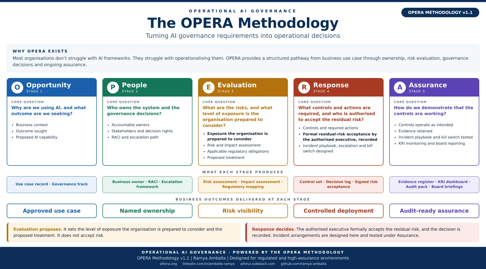

# OPERA Methodology

Turning AI governance requirements into operational decisions.

---

## Why OPERA Exists

Most organisations do not struggle because they lack AI governance frameworks.

They struggle with operationalising them.

OPERA provides a structured path from business use case through ownership, risk evaluation, governance decisions and ongoing assurance.

---

## OPERA Framework

**O → Opportunity**

Why are we using AI, and what outcome are we seeking?

Deliverables:
- AI Use Case Intake
- Business Context
- Initial Classification

---

**P → People**

Who owns the system and the governance decisions?

Deliverables:
- Ownership Matrix
- Stakeholder Mapping
- Governance Roles

---

**E → Evaluation**

What are the risks, and what level of exposure is the organisation prepared to consider?

Determines the level of exposure the organisation is prepared to consider, assesses the risks and identifies the proposed treatment. Also where applicable regulatory obligations are determined and compliance exposure is assessed. Evaluation proposes; it does not accept risk.

Deliverables:
- AI Inventory
- Risk Assessment
- Regulatory Mapping

---

**R → Response**

What controls and actions are required, and who is authorised to accept the residual risk?

The authorised executive makes and records the formal residual-risk acceptance decision here. The incident playbook, escalation arrangements and kill switch are also designed here, as required actions.

Deliverables:
- Decision Records
- Control Mapping
- Implementation Actions

---

**A → Assurance**

How do we demonstrate that the controls are working?

Establishes whether the controls operate as intended and retains the evidence needed to demonstrate that. The incident playbook, escalation arrangements and kill switch designed under Response are tested here, and evidence of their effectiveness is retained.

Deliverables:
- Evidence Register
- Monitoring Activities
- Audit Readiness

---

## Retired terminology

An earlier version of OPERA used the stage names Ownership, Planning, Evaluation, Review, Assurance. That terminology is retired and is not an alternative definition of OPERA. Current methodology pages, diagrams and case studies use Opportunity, People, Evaluation, Response, Assurance only.

---

## Status

Version: OPERA v1.1
Status: Current

## OPERA in Practice

The methodology is implemented through supporting artefacts and practical scenarios.

Examples:

- [AI Governance Decision Lab](../02-Decision-Lab/AI-Third-Party-Risk-Intelligence-Assistant/)
- Implementation Lab
- Practitioner Resources
- Templates

Supporting workflow and implementation visuals are available through the Decision Lab examples.
